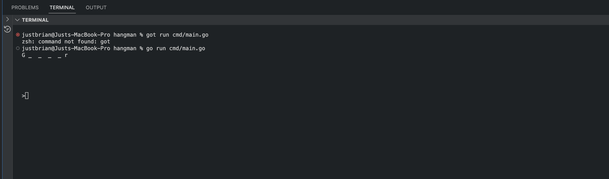
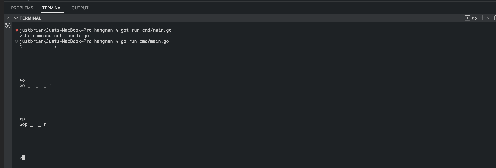
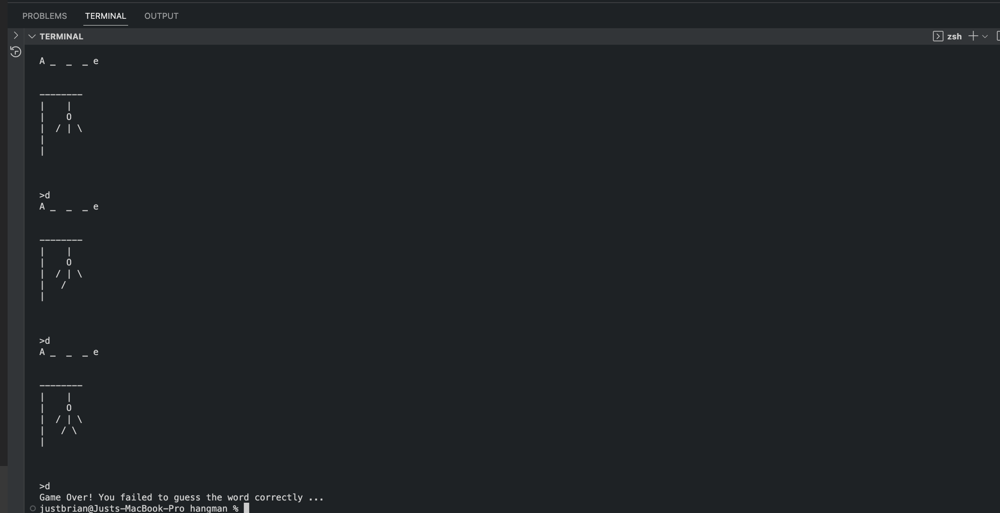

# hangman_go

A terminal hangman game made in Go 1.20

Hangman_go was originally programmed as part of my journey learning Go, but I found it too fun not to share. I hope you find this as enjoyable as I do.

## Usage

Simply type `go run cmd/main.go` in the root of the project folder.

This program allows you to play hangman with a word that is randomly chosen from the dict file(found on the project's root folder).

## Snips

