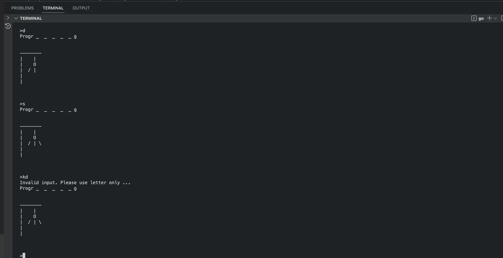

# hangman_go

A simple terminal hangman game made in Go 1.20

Hangman_go was originally programmed as part of my journey learning Go, but I found it too fun not to share. I hope you find this as enjoyable as I do.

## Note

This is no way a comprehensive hangman game. It has a lot of features that could be added and potentially a couple of unhandled bugs.

## Usage

Simply type `go run cmd/main.go` in the root of the project folder.

This program allows you to play hangman with a word that is randomly chosen from the dict file(found on the project's root folder).

Feel free to add and remove words from the dict file.

This has primarily been build for only letters from the English alphabet are read, so I recommend you use only English words on the dict file.

## Snips

